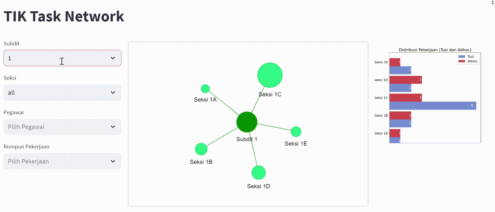

# task-network

Author: Riki Akbar

The Task Network is an application that utilizes the power of a graph network to manage and distribute information about tasks within an organization. 
This is a prototype and remains under development at the moment. Feel free to use but please keep the attribution intact.

Sneak Peak:

  
  

